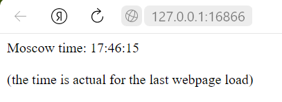
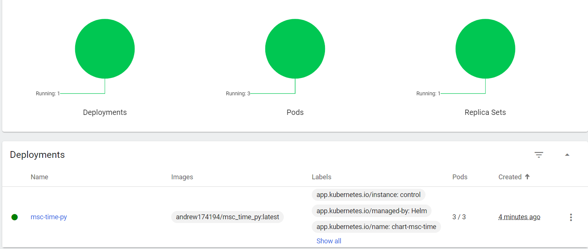

# Deployment with Kibernetes
> I used `minikube` for this lab

## Process of manual deployment

0. Download `kubectl` & prepare envornment for work with it. Start Docker, use `minikube start`
1. Deploy our Docker image: `kubectl create deployment msc-time-py --image=andrew174194/msc_time_py:latest`
2. Expose deployment with k8s' LoadBalancer: `kubectl expose deployment msc-time-py --type=LoadBalancer --port=5000`
3. We can address to appication from the outside of cluster by `minikube service msc-time-py`

### Result
```sh
$ kubectl get pods,svc
NAME                              READY   STATUS    RESTARTS   AGE
pod/msc-time-py-64b6b57d5-l2mmf   1/1     Running   0          12m

NAME                  TYPE           CLUSTER-IP       EXTERNAL-IP   PORT(S)          AGE
service/kubernetes    ClusterIP      10.96.0.1        <none>        443/TCP          28m
service/msc-time-py   LoadBalancer   10.100.213.215   <pending>     5000:31730/TCP   90s
```

## Automatic configuration

I create [deployment.yml](deployment.yml) and [service.yml](service.yml) for confoguration of deployment (3 pods) and exposer respectively
> Tho we could put both configs on the same file

Apply configurations with `kubectl apply -f .\k8s\deployment.yml` and `kubectl apply -f .\k8s\service.yml`

### Result
```sh
$ kubectl get pods,svc
NAME                               READY   STATUS    RESTARTS   AGE
pod/msc-time-py-84b886c7b5-nwjkw   1/1     Running   0          5m
pod/msc-time-py-84b886c7b5-wjqq5   1/1     Running   0          5m
pod/msc-time-py-84b886c7b5-zkhrc   1/1     Running   0          5m

NAME                 TYPE           CLUSTER-IP       EXTERNAL-IP   PORT(S)        AGE
service/exposer      LoadBalancer   10.104.214.199   <pending>     80:30748/TCP   5s
service/kubernetes   ClusterIP      10.96.0.1        <none>        443/TCP        89m
```

```sh
$ minikube service --all
|-----------|---------|-------------|---------------------------|
| NAMESPACE |  NAME   | TARGET PORT |            URL            |
|-----------|---------|-------------|---------------------------|
| default   | exposer |          80 | http://192.168.49.2:30748 |
|-----------|---------|-------------|---------------------------|
|-----------|------------|-------------|--------------|
| NAMESPACE |    NAME    | TARGET PORT |     URL      |
|-----------|------------|-------------|--------------|
| default   | kubernetes |             | No node port |
|-----------|------------|-------------|--------------|
😿  service default/kubernetes has no node port
🏃  Starting tunnel for service exposer.
🏃  Starting tunnel for service kubernetes.
| NAMESPACE |    NAME    | TARGET PORT |          URL           |
|-----------|------------|-------------|------------------------|
| default   | exposer    |             | http://127.0.0.1:16866 |
| default   | kubernetes |             | http://127.0.0.1:16868 |
|-----------|------------|-------------|------------------------|
```

And by this way, we have accessible application on http://127.0.0.1:16866



## Bonus: About Ingress, Ingress controller, StatefulSet, DaemonSet & PersistentVolumes
**Ingress** is a Kubernetes tool that allows to balance load, control live status of pods and automatically manage VMs and network.  
There can multiple **Ingress controllers** which helps with managment on different tools and hostings.  

**StatefulSet** is similar to Deployment - it allows to manage pods, but unlike the Deployment can manage uniqueness of pods and capable to work with different application states on different machines.

**DaemonSet** controls pods on every node, so when new node is added to cluster - new pods will be created or some pods will be transfered from one node to new one.

**PersistentVolumes** is similar to Docker volume - it is a common storage that is available for all pods where each of them can store files.

# Helm installation

I created a new chart [chart-msc-time](./chart-msc-time) with `helm create chart-msc-time` command.  
Next I set necessary parameters inside [`values.yaml`](chart-msc-time/values.yaml) as in [deployment.yml](deployment.yml) and [service.yml](service.yml) and changed `containerPort` for container in [templates/deployment.yaml](chart-msc-time/templates/deployment.yaml).  

Install helm packeges with `helm install control chart-msc-time` (or `helm upgrade control chart-msc-time` if it's not your first try).  

As a proof there is a Dashdoard's Workloads page screen  


As you can notice, the second label mentions that deployment is managed by Helm - it is success!

Service for access application outside the Docker net also works:
```sh
minikube service msc-time-py
|-----------|-------------|-------------|---------------------------|
| NAMESPACE |    NAME     | TARGET PORT |            URL            |
|-----------|-------------|-------------|---------------------------|
| default   | msc-time-py | http/80     | http://192.168.49.2:32391 |
|-----------|-------------|-------------|---------------------------|
🏃  Starting tunnel for service msc-time-py.
|-----------|-------------|-------------|------------------------|
| NAMESPACE |    NAME     | TARGET PORT |          URL           |
|-----------|-------------|-------------|------------------------|
| default   | msc-time-py |             | http://127.0.0.1:17523 |
|-----------|-------------|-------------|------------------------|
🎉  Opening service default/msc-time-py in default browser...
```

The overall picture is the following:
```sh
$ kubectl get pods,svc
NAME                               READY   STATUS    RESTARTS   AGE
pod/msc-time-py-765b494497-527bf   1/1     Running   0          5m14s
pod/msc-time-py-765b494497-jnsq9   1/1     Running   0          5m14s
pod/msc-time-py-765b494497-mmm77   1/1     Running   0          5m14s

NAME                  TYPE           CLUSTER-IP     EXTERNAL-IP   PORT(S)        AGE
service/kubernetes    ClusterIP      10.96.0.1      <none>        443/TCP        8d
service/msc-time-py   LoadBalancer   10.97.139.70   <pending>     80:32391/TCP   5m14s
```


